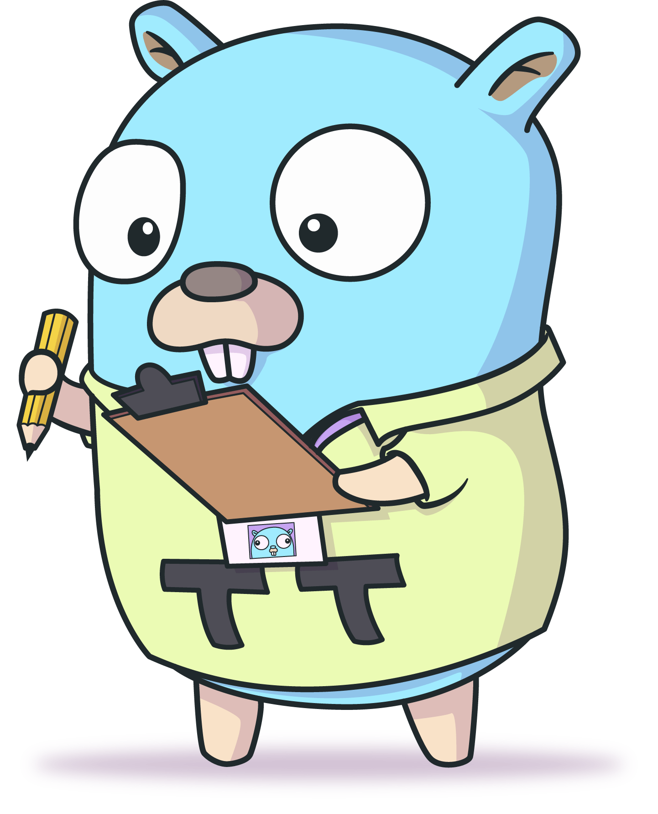

<div align="center">
  <h1>ttest</h1>
  
  <p>
    <a href="https://app.travis-ci.com/celicoo/tt">
      
    </a>
    <a href="https://codecov.io/gh/celicoo/ttest">
      
    </a>
    <a href="https://godoc.org/github.com/celicoo/tt">
      
    </a>
  </p>
</div>

TODO
Wouldn't be nice if you could write table tests in Go in a consistant matter, and get them outputed like an actual table? Now you can! Introducing ttest, a a testing library for the Go programming language. It provides a convenient and flexible way to define and run test cases, and adds support for table-driven testing on top of the standard testing package.

## Getting Started

To install ttest, run the following command:

```
go get github.com/celicoo/ttest
```

Import the ttest package in your test file:

```go
package your_test

import (
    "testing"

    "github.com/celicoo/ttest"
)
```

## Usage

TODO

## Contributing

We welcome contributions to ttest! If you would like to contribute, please follow these guidelines:

* Fork the repository and create a new branch for your changes.
* Make your changes and commit them with a descriptive commit message.
* Push your branch and open a pull request.
* Be sure to include a detailed description of your changes and any relevant rationale.

## License

ttest is licensed under the MIT License. See LICENSE for more information.

## Acknowledgements

ttest is built on top of the standard testing package provided by the Go standard library.

## Support

If you encounter any issues or have any questions about using ttest, please file an issue on the project's GitHub page. You can also contact the maintainers directly for assistance.
